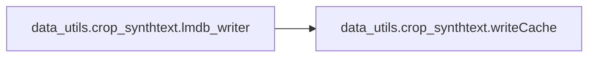
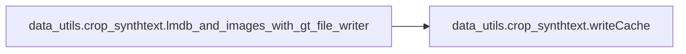
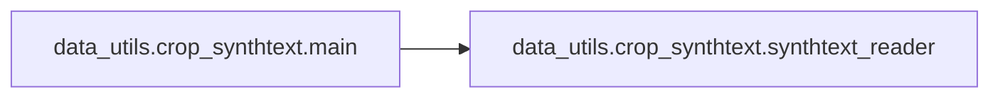

# Data Utils Crop Synthtext

[_Documentation generated by Documatic_](https://www.documatic.com)

<!---Documatic-section-Codebase Structure-start--->
## Codebase Structure

<!---Documatic-block-system_architecture-start--->
```mermaid
None
```
<!---Documatic-block-system_architecture-end--->

# #
<!---Documatic-section-Codebase Structure-end--->

<!---Documatic-section-data_utils.crop_synthtext.crop_box_worker-start--->
## data_utils.crop_synthtext.crop_box_worker

<!---Documatic-section-crop_box_worker-start--->
<!---Documatic-block-data_utils.crop_synthtext.crop_box_worker-start--->
<details>
	<summary><code>data_utils.crop_synthtext.crop_box_worker</code> code snippet</summary>

```python
def crop_box_worker(args):
    (image_name, txt, boxes, queue) = args
    cropped_indx = 0
    txt = [re.split(' \n|\n |\n| ', t.strip()) for t in txt]
    txt = list(chain(*txt))
    txt = [t for t in txt if len(t) > 0]
    img = cv2.imread(image_name, cv2.IMREAD_COLOR)
    (img_height, img_width, _) = img.shape
    if len(np.shape(boxes)) == 2:
        wordBBlen = 1
    else:
        wordBBlen = boxes.shape[-1]
    if wordBBlen == len(txt):
        for word_indx in range(len(txt)):
            if len(np.shape(boxes)) == 2:
                wordBB = boxes
            else:
                wordBB = boxes[:, :, word_indx]
            if np.shape(wordBB) != (2, 4):
                err_log = 'malformed box index: {}\t{}\t{}\n'.format(image_name, txt[word_indx], wordBB)
                logger.debug(err_log)
                continue
            pts1 = np.float32([[wordBB[0][0], wordBB[1][0]], [wordBB[0][3], wordBB[1][3]], [wordBB[0][1], wordBB[1][1]], [wordBB[0][2], wordBB[1][2]]])
            height = math.sqrt((wordBB[0][0] - wordBB[0][3]) ** 2 + (wordBB[1][0] - wordBB[1][3]) ** 2)
            width = math.sqrt((wordBB[0][0] - wordBB[0][1]) ** 2 + (wordBB[1][0] - wordBB[1][1]) ** 2)
            if height * width <= 0:
                err_log = 'empty file : {}\t{}\t{}\n'.format(image_name, txt[word_indx], wordBB)
                logger.debug(err_log)
                continue
            elif height * width > img_height * img_width:
                err_log = 'too big box : {}\t{}\t{}\n'.format(image_name, txt[word_indx], wordBB)
                logger.debug(err_log)
                continue
            else:
                valid = True
                for i in range(2):
                    for j in range(4):
                        if wordBB[i][j] < 0 or wordBB[i][j] > img.shape[1 - i]:
                            valid = False
                            break
                    if not valid:
                        break
                if not valid:
                    err_log = 'invalid coord : {}\t{}\t{}\t{}\t{}\n'.format(image_name, txt[word_indx], wordBB, (width, height), (img_width, img_height))
                    logger.debug(err_log)
                    continue
            pts2 = np.float32([[0, 0], [0, height], [width, 0], [width, height]])
            M = cv2.getPerspectiveTransform(pts1, pts2)
            img_cropped = cv2.warpPerspective(img, M, (int(width), int(height)))
            cropped_dir_name = image_name.split('/')[-2]
            cropped_file_name = '{}_{}_{}.jpg'.format(cropped_indx, image_name.split('/')[-1][:-len('.jpg')], word_indx)
            cropped_indx += 1
            data = dict(cropped_dir_name=cropped_dir_name, filename=cropped_file_name, transcript=txt[word_indx], image=img_cropped)
            queue.put(data)
    else:
        err_log = 'word_box_mismatch : {}\t{}\t{}\n'.format(image_name, txt, boxes)
        logger.write(err_log)
```
</details>
<!---Documatic-block-data_utils.crop_synthtext.crop_box_worker-end--->
<!---Documatic-section-crop_box_worker-end--->

# #
<!---Documatic-section-data_utils.crop_synthtext.crop_box_worker-end--->

<!---Documatic-section-data_utils.crop_synthtext.writeCache-start--->
## data_utils.crop_synthtext.writeCache

<!---Documatic-section-writeCache-start--->
<!---Documatic-block-data_utils.crop_synthtext.writeCache-start--->
<details>
	<summary><code>data_utils.crop_synthtext.writeCache</code> code snippet</summary>

```python
def writeCache(env, cache: dict):
    with env.begin(write=True) as txn:
        for (k, v) in cache.items():
            txn.put(k.encode(), v)
```
</details>
<!---Documatic-block-data_utils.crop_synthtext.writeCache-end--->
<!---Documatic-section-writeCache-end--->

# #
<!---Documatic-section-data_utils.crop_synthtext.writeCache-end--->

<!---Documatic-section-data_utils.crop_synthtext.lmdb_writer-start--->
## data_utils.crop_synthtext.lmdb_writer

<!---Documatic-section-lmdb_writer-start--->


### Object Calls

* data_utils.crop_synthtext.writeCache

<!---Documatic-block-data_utils.crop_synthtext.lmdb_writer-start--->
<details>
	<summary><code>data_utils.crop_synthtext.lmdb_writer</code> code snippet</summary>

```python
def lmdb_writer(lmdb_path: str, queue: Queue):
    env = lmdb.open(lmdb_path, map_size=1099511627776)
    buffer = {}
    counter = 0
    while True:
        data = queue.get()
        if data != 'Done':
            counter += 1
            img_cropped = data['image']
            img_cropped = cv2.imencode('.jpg', img_cropped)[1]
            buffer['image-{}'.format(counter)] = img_cropped.tobytes()
            buffer['transcript-{}'.format(counter)] = data['transcript'].encode()
            if counter % LMDB_WRITE_BATCH == 0 and counter != 0:
                writeCache(env, buffer)
                logger.info('{} done.'.format(counter))
                buffer = {}
        else:
            buffer['nSamples'] = str(counter).encode()
            writeCache(env, buffer)
            logger.info('Finished. Total {}'.format(counter))
            break
```
</details>
<!---Documatic-block-data_utils.crop_synthtext.lmdb_writer-end--->
<!---Documatic-section-lmdb_writer-end--->

# #
<!---Documatic-section-data_utils.crop_synthtext.lmdb_writer-end--->

<!---Documatic-section-data_utils.crop_synthtext.images_with_gt_file_writer-start--->
## data_utils.crop_synthtext.images_with_gt_file_writer

<!---Documatic-section-images_with_gt_file_writer-start--->
<!---Documatic-block-data_utils.crop_synthtext.images_with_gt_file_writer-start--->
<details>
	<summary><code>data_utils.crop_synthtext.images_with_gt_file_writer</code> code snippet</summary>

```python
def images_with_gt_file_writer(images_path: str, gt_file: str, queue: Queue):
    gtfile = os.path.join(images_path, gt_file)
    counter = 0
    while True:
        data = queue.get()
        if data != 'Done':
            cropped_dir_name = data['cropped_dir_name']
            filename = data['filename']
            transcript = data['transcript']
            img_cropped = data['image']
            cropped_dir = os.path.join(images_path, cropped_dir_name)
            if not os.path.exists(cropped_dir):
                os.mkdir(cropped_dir)
            cropped_file_name = os.path.join(cropped_dir, filename)
            cv2.imwrite(cropped_file_name, img_cropped)
            with open(gtfile, 'a+', encoding='utf-8') as gt_f:
                gt_f.write('%s,%s\n' % (os.path.join(cropped_dir_name, filename), transcript))
            counter += 1
            if counter % LMDB_WRITE_BATCH == 0 and counter != 0:
                logger.info('{} done.'.format(counter))
        else:
            logger.info('Finished. Total {}'.format(counter))
            break
```
</details>
<!---Documatic-block-data_utils.crop_synthtext.images_with_gt_file_writer-end--->
<!---Documatic-section-images_with_gt_file_writer-end--->

# #
<!---Documatic-section-data_utils.crop_synthtext.images_with_gt_file_writer-end--->

<!---Documatic-section-data_utils.crop_synthtext.lmdb_and_images_with_gt_file_writer-start--->
## data_utils.crop_synthtext.lmdb_and_images_with_gt_file_writer

<!---Documatic-section-lmdb_and_images_with_gt_file_writer-start--->


### Object Calls

* data_utils.crop_synthtext.writeCache

<!---Documatic-block-data_utils.crop_synthtext.lmdb_and_images_with_gt_file_writer-start--->
<details>
	<summary><code>data_utils.crop_synthtext.lmdb_and_images_with_gt_file_writer</code> code snippet</summary>

```python
def lmdb_and_images_with_gt_file_writer(lmdb_path: str, images_path: str, gt_file: str, queue: Queue):
    env = lmdb.open(lmdb_path, map_size=1099511627776)
    gtfile = os.path.join(images_path, gt_file)
    buffer = {}
    counter = 0
    while True:
        data = queue.get()
        if data != 'Done':
            counter += 1
            img_cropped = data['image']
            transcript = data['transcript']
            img_cropped_buf = cv2.imencode('.jpg', img_cropped)[1]
            buffer['image-{}'.format(counter)] = img_cropped_buf.tobytes()
            buffer['transcript-{}'.format(counter)] = transcript.encode()
            cropped_dir_name = data['cropped_dir_name']
            filename = data['filename']
            cropped_dir = os.path.join(images_path, cropped_dir_name)
            if not os.path.exists(cropped_dir):
                os.mkdir(cropped_dir)
            cropped_file_name = os.path.join(cropped_dir, filename)
            cv2.imwrite(cropped_file_name, img_cropped)
            with open(gtfile, 'a+', encoding='utf-8') as gt_f:
                gt_f.write('%s,%s\n' % (os.path.join(cropped_dir_name, filename), transcript))
            if counter % LMDB_WRITE_BATCH == 0 and counter != 0:
                writeCache(env, buffer)
                logger.info('{} done.'.format(counter))
                buffer = {}
        else:
            buffer['nSamples'] = str(counter).encode()
            writeCache(env, buffer)
            logger.info('Finished. Total {}'.format(counter))
            break
```
</details>
<!---Documatic-block-data_utils.crop_synthtext.lmdb_and_images_with_gt_file_writer-end--->
<!---Documatic-section-lmdb_and_images_with_gt_file_writer-end--->

# #
<!---Documatic-section-data_utils.crop_synthtext.lmdb_and_images_with_gt_file_writer-end--->

<!---Documatic-section-data_utils.crop_synthtext.synthtext_reader-start--->
## data_utils.crop_synthtext.synthtext_reader

<!---Documatic-section-synthtext_reader-start--->
<!---Documatic-block-data_utils.crop_synthtext.synthtext_reader-start--->
<details>
	<summary><code>data_utils.crop_synthtext.synthtext_reader</code> code snippet</summary>

```python
def synthtext_reader(synthtext_folder: str, queue: Queue, pool: Pool):
    synthtext_folder = Path(synthtext_folder)
    logger.info('Loading gt.mat ...')
    mat_contents = sio.loadmat(synthtext_folder.joinpath('gt.mat'))
    logger.info('Loading finish.')
    image_names = mat_contents['imnames'][0]
    pool.map(crop_box_worker, iter([(synthtext_folder.joinpath(item[0]).absolute().as_posix(), mat_contents['txt'][0][index], mat_contents['wordBB'][0][index], queue) for (index, item) in enumerate(image_names[:])]))
```
</details>
<!---Documatic-block-data_utils.crop_synthtext.synthtext_reader-end--->
<!---Documatic-section-synthtext_reader-end--->

# #
<!---Documatic-section-data_utils.crop_synthtext.synthtext_reader-end--->

<!---Documatic-section-data_utils.crop_synthtext.main-start--->
## data_utils.crop_synthtext.main

<!---Documatic-section-main-start--->


### Object Calls

* data_utils.crop_synthtext.synthtext_reader

<!---Documatic-block-data_utils.crop_synthtext.main-start--->
<details>
	<summary><code>data_utils.crop_synthtext.main</code> code snippet</summary>

```python
def main(args):
    if not Path(args.synthtext_folder).exists():
        logger.error('synthtext_folder does not exist!')
        raise FileNotFoundError
    manager = Manager()
    queue = manager.Queue(maxsize=QUEUE_SIZE)
    if args.data_format == 'lmdb':
        writer_process = Process(target=lmdb_writer, name='lmdb writer', args=(args.lmdb_path, queue), daemon=True)
    elif args.data_format == 'images_with_gt_file':
        Path(args.images_folder).mkdir(parents=True, exist_ok=True)
        writer_process = Process(target=images_with_gt_file_writer, name='images_with_gt_file writer', args=(args.images_folder, args.gt_file, queue), daemon=True)
    else:
        Path(args.images_folder).mkdir(parents=True, exist_ok=True)
        writer_process = Process(target=lmdb_and_images_with_gt_file_writer, name='lmdb_and_images_with_gt_file_writer writer', args=(args.lmdb_path, args.images_folder, args.gt_file, queue), daemon=True)
    writer_process.start()
    logger.info('{} writer is started with PID: {}'.format(args.data_format, writer_process.pid))
    pool = Pool(processes=WORKERS, maxtasksperchild=10000)
    try:
        logger.info('Start cropping...')
        synthtext_reader(args.synthtext_folder, queue, pool)
        queue.put('Done')
        pool.close()
        pool.join()
        writer_process.join()
        writer_process.close()
        logger.info('End cropping.')
    except KeyboardInterrupt:
        logger.info('Terminated by Ctrl+C.')
        pool.terminate()
        pool.join()
```
</details>
<!---Documatic-block-data_utils.crop_synthtext.main-end--->
<!---Documatic-section-main-end--->

# #
<!---Documatic-section-data_utils.crop_synthtext.main-end--->

[_Documentation generated by Documatic_](https://www.documatic.com)